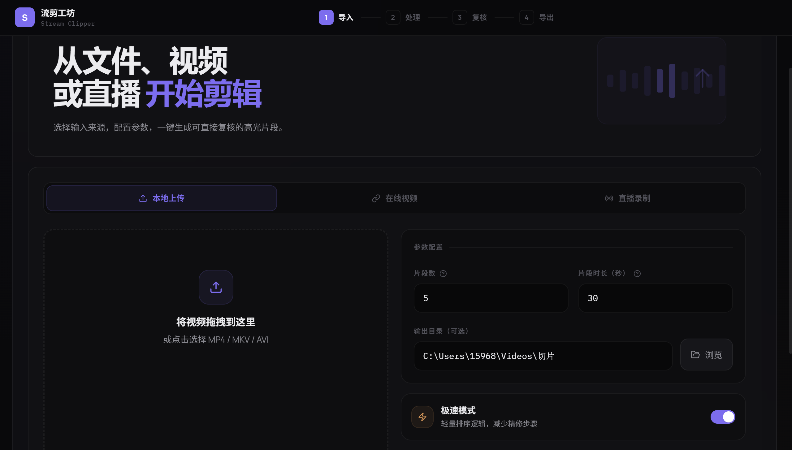
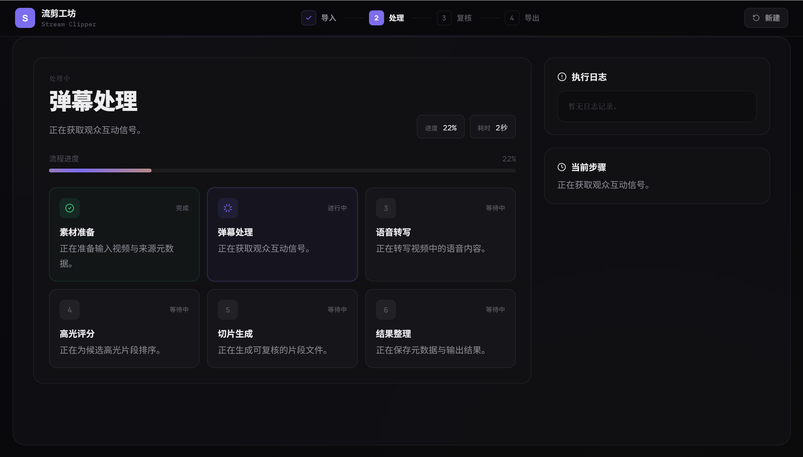
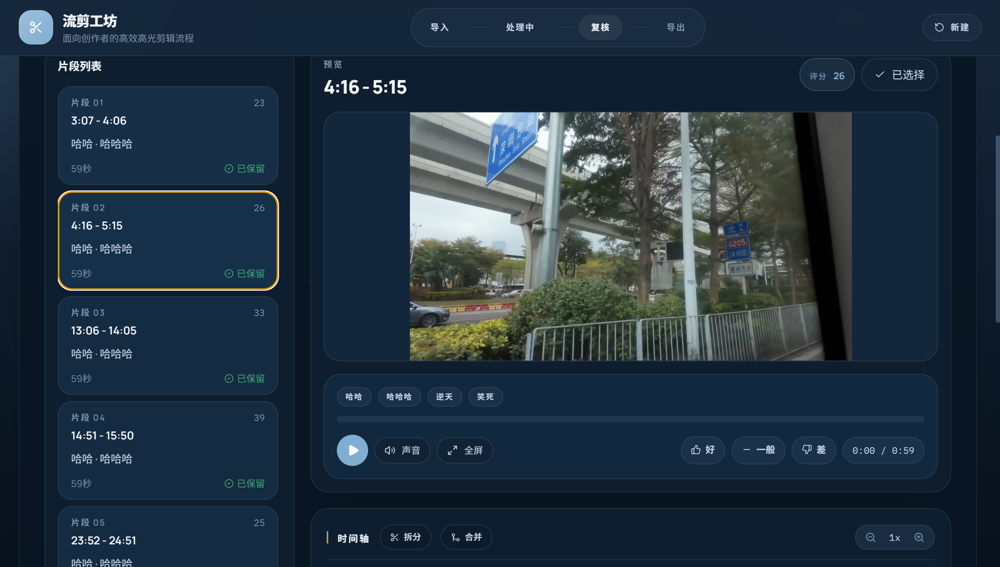
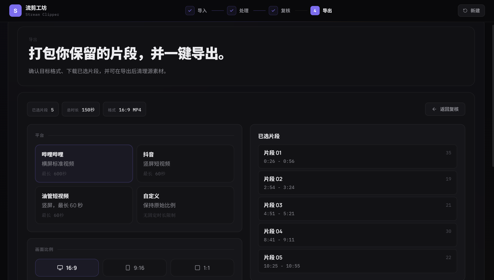

<div align="center">

**[English](README_EN.md)** | **中文**

# 流剪工坊 · Stream Clipper

**把几小时的直播录播变成几分钟的高光片段。**

粘贴链接或拖入视频 → 自动定位名场面 → 逐条复核 → 一键导出

[快速开始](#快速开始) · [桌面版下载](#桌面版) · [工作原理](#工作原理) · [反馈](#反馈与贡献)

</div>

---

## 它解决什么问题

做直播切片，最耗时间的不是剪辑，是**从几小时录播里找到值得剪的几分钟**。

Stream Clipper 自动分析弹幕和语音，定位高光时刻，切好片段等你复核。

## 截图

<table>
<tr>
<td width="50%">

**导入** — 支持本地文件、B站/YouTube 链接、直播录制



</td>
<td width="50%">

**处理** — 6 步自动流水线，实时显示进度



</td>
</tr>
<tr>
<td width="50%">

**复核** — 逐条预览片段，评分筛选，时间轴微调



</td>
<td width="50%">

**导出** — 选择目标平台格式，批量导出



</td>
</tr>
</table>

## 工作原理

分析三个信号，定位高光时刻：

| 信号 | 说明 |
|------|------|
| **弹幕密度** | 弹幕突然密集的地方，通常有事发生 |
| **情绪词频率** | "牛逼""哈哈哈""卧槽"等情绪词集中爆发 |
| **语义重合** | 主播说的话和弹幕内容高度重合（ASR + CJK Jaccard） |

三个信号加权叠加 → 高斯平滑 → 峰值检测 → 自动切片。

## 功能

- **多源导入**：本地视频、B站 VOD、YouTube、抖音、直播间实时录制
- **ASR 转写**：faster-whisper 本地运行，无需联网
- **高光评分**：弹幕密度 + 情绪词 + 语义重合，三信号融合
- **复核工作流**：视频预览、评分标注（好/一般/差）、时间轴拆分/合并
- **多平台导出**：B站横屏 / 抖音竖屏 / YouTube Shorts / 自定义比例
- **反馈学习**：标注结果自动记录，可训练轻量排序模型持续优化

## 快速开始

### 环境要求

- Python 3.11+
- Node.js 18+
- FFmpeg（需在 PATH 中）

### 安装与运行

```bash
git clone https://github.com/Cbhhhh211/Stream-Clipper-Factory.git
cd Stream-Clipper-Factory

# 安装 Python 依赖
pip install -r requirements.txt

# 构建前端
cd frontend && npm install && npm run build && cd ..

# 启动（同时运行 API 和前端）
python app.py
```

打开浏览器访问 `http://127.0.0.1:5173`

### Docker

```bash
docker compose up
```

GPU 加速（CUDA）：

```bash
docker compose -f docker-compose.yml build --build-arg DOCKERFILE=Dockerfile.gpu
```

## 桌面版

不想配环境？下载桌面版，解压即用：

👉 [Releases 页面下载](https://github.com/Cbhhhh211/Stream-Clipper-Factory/releases)

- Windows 10/11 x64
- 内置 Python 运行时 + FFmpeg，无需额外安装

## 项目结构

```
├── frontend/          React 前端（Vite + Tailwind）
├── services/          FastAPI 服务层（路由、worker、队列）
├── stream_clipper/    核心算法（ASR、弹幕分析、评分、剪辑）
├── tools/             训练与评估脚本
├── tests/             测试用例
└── app.py             一键启动入口
```

## 反馈训练

用户在复核阶段的评分（好/一般/差）会自动记录：

```
output/_api_jobs/_feedback/clip_feedback.jsonl
```

积累足够数据后，训练轻量排序模型：

```bash
python tools/train_feedback_ranker.py
```

模型会学习你的偏好，后续推荐更准。

## 技术栈

| 层 | 技术 |
|----|------|
| 前端 | React · Vite · Tailwind CSS · Zustand |
| 后端 | FastAPI · uvicorn |
| ASR | faster-whisper |
| 视频处理 | FFmpeg · ffmpeg-python · yt-dlp |
| 信号处理 | NumPy · SciPy（高斯平滑 + 峰值检测） |
| 弹幕 | WebSocket 实时采集（B站协议）· XML 解析 |

## 反馈与贡献

- 有 Bug 或建议？[提 Issue](https://github.com/Cbhhhh211/Stream-Clipper-Factory/issues)
- 想贡献代码？Fork → 改 → PR

## License

[MIT](LICENSE)
